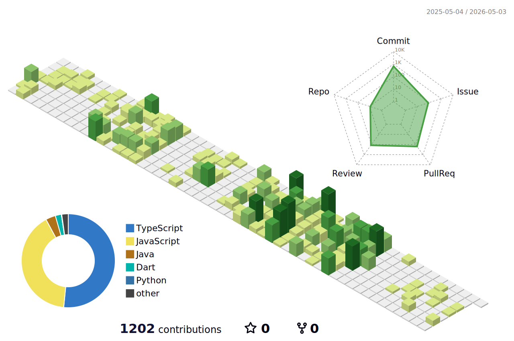

---

<!-- 

 -->

  <!-- 이미지 아래에서 새 줄 시작 -->
  
<h3> 🔎 EXPERIENCE </h3>
     
***교육 / 챌린지***
- **University Makeus Challenge (UMC) 8기** – `Node.js` 챌린저 수료 (2025.03 ~ 2025.08)  
- **멋쟁이 사자처럼 클라우드 엔지니어링 4기 수강** – `Infra` (2025.07 ~ 2026.01)  
- **University Makeus Challenge (UMC) 9기** – `Web` 챌린저 (2025.09 ~ )  

***프로젝트 / 실무***
- **[홈인스펙터] 사전점검 업체 어플 유지보수** (2024.12 ~ ) – `Flutter(Web/App)` + `Node.js`  
  - 홈인스펙터 사전점검 어플 (App)
  - 홈인스펙터 예약 웹페이지 (Web)
  
***대회 / 수상***
- **9th Ne(o)rdinary Hackathon 우수상** 수상 (2025.11.22~2025.11.23) -  `Node.js`
- **9th UMC 장기해커톤 우수상** 수상 (2025.12.22) - `Web`
- **4th 멋쟁이 사자처럼 최종 프로젝트 최우수상** 수상 (2026.01.14) - `Web` & `Spring Boot` (`Dev Lead`)

 
 
 
 <h3> 🌱 STACK </h3>

<strong>Language</strong>  
  

<strong>Frontend</strong>  

<strong>Backend</strong>  
    

<strong>Infra</strong>  
  

<strong>Database & Cache</strong>  
  

---

<!-- <h3>🏅 Baekjoon</h3>
    

      
      
    
 -->

 <h3>🐶 MY PET !! 🐻‍❄️</h3>
 

 
 
<h3> 🌱 GITHUB 3D </h3>

